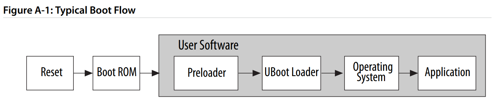
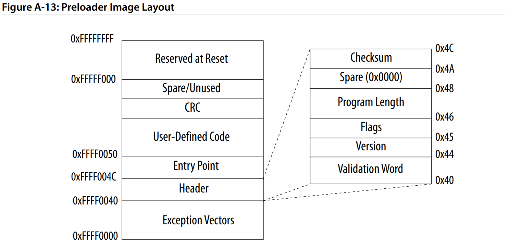
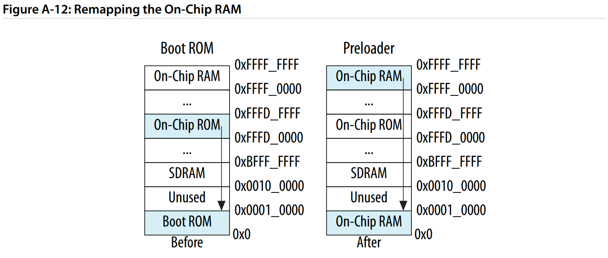

#+HUGO_BASE_DIR: ../
#+HUGO_SECTION: wiki
#+OPTIONS: toc:2
#+author: lockbox

* Wiki
:PROPERTIES:
:EXPORT_FILE_NAME: _index
:END:

#+begin_description
My eternal post-it notes
#+end_description
* Yubikey-GPG on linux
:PROP
ERTIES:
:EXPORT_DATE: 2023-12-28
:EXPORT_FILE_NAME: yubikey-gpg-linux
:END:

TLDR; =man 1 gpg=

** Yubikey-SSH

Requirements:
-  =openssh= build with support for security keys
  On Gentoo:

  #+begin_src shell
  USE=security-key emerge -aq net-misc/openssh
  #+end_src

Then you unlock the ability to create new ssh-keys with the =*-sk= suffix.
You also probably want to add the options to make the key resident on the key
and to require authorization every time a la:

#+begin_src shell
 ssh-keygen -t ecdsa-sk -O resident -O application=ssh:text -O verify-required
#+end_src

Note that the "text" portion can be anything
** Important Links
Start with the gentoo setup instructions, as they're consistently decent.
  - [Yubikey on Gentoo](https://wiki.gentoo.org/wiki/YubiKey)
  - [Yubikey/GPG](https://wiki.gentoo.org/wiki/YubiKey/GPG)
  - [Yubikey/GPG + SSH](https://wiki.gentoo.org/wiki/YubiKey/SSH)
  - [Gentoo Dev GPG guide](https://wiki.gentoo.org/wiki/Project:Infrastructure/Generating_GLEP_63_based_OpenPGP_keys#How_to_generate_the_GLEP_63-compliant_OpenPGP_key)
  - [Gentoo GnuPG](https://wiki.gentoo.org/wiki/GnuPG)

Then follow them up with the actual [YubiKey Docs](https://developers.yubico.com/SSH/Securing_SSH_with_FIDO2.html)

Adding gpg to git commits:
- <https://git-scm.com/book/en/v2/Git-Tools-Signing-Your-Work>

Relevant resources:
- <https://peterbabic.dev/blog/gnupg-pin-cache-smartcards-yubikeys-and-notifications/>
- <https://www.reddit.com/r/yubikey/comments/kfxiue/sign_git_commit_without_entering_pin/>

* Updating Nix daemon settings
:PROPERTIES:
:EXPORT_DATE: 2024-02-10
:EXPORT_FILE_NAME: nix-settings-update
:END:

TLDR;

#+begin_src shell
 sudo kill-all nix-daemon
#+end_src

or

#+begin_src shell
 nix -k <command you were going to run>
#+end_src

Why do you need to restart the daemon when a config file is changed as opposed to just telling it to reload?
Not sure but this works for now.

** Related github issue
[[github:NixOS/nix/issues/8939][NixOS autoreload config file on change]]

* Simplified Boot Flow for the Cyclone V
:PROPERTIES:
:EXPORT_DATE: 2024-02-18
:EXPORT_FILE_NAME: cyclone-v-boot
:END:

The [Cyclone V Technical Reference Manual](https://www.intel.com/content/www/us/en/docs/programmable/683126/21-2/hard-processor-system-technical-reference.html)
details the boot flow for the common "running linux to boot your FPGA" usecase like so:

#+CAPTION: Technical Reference Manual Diagram of Typical Boot Flow
#+NAME: fig: cyclone-v-boot-flow

But because everything after the BootROM is classified as "user software," there is not much described in the manual.

What the manual describes as "user software" still encompasses an entire software stack built,
maintained, and packaged by Altera, but *can* be overriden by the user. As far as behavior and
code that users cannot overwrite go, we are limited to the BootROM.

The BootROM is described in short on page =A-5=, and the state machine is fully diagrammed on
page =A-27=.

- BootROM is 64kb in size
- Located in on-chip ROM at address range =0xFFFD_0000= to =0xFFFD_FFFF=
- The purpose is to determine the boot source, initialize the HPS after reset, and jump to the PreLoader

There is a little more nuance if the PreLoader needs to be loaded from flash into RAM. RTFM for more.

** Executing User Software

The BootROM's entire purpose is to call the PreLoader, and setup the initial environment necessary for
the PreLoader to be able to load the BootLoader (u-boot) which in turn loads the Operating System (Linux).

Page =A-31= details the entry state of the processor on calling the PreLoader:
- I-cache disabled
- Branch Predictor enabled
- D cache disabled
- MMU disabled
- FPU enabled
- NEON enabled
- Processor is in ARM =supervisor= mode

Register state:
- =r0=: pointer to shared memory block used to pass information to PreLoader (located in top 4kb of on-chip RAM)
- =r1=: length of the shared memory
- =r2=: set to =0x0=
- =r3=: reserved

Other system state:
- BootROM is mapped to address =0x0=
- =L4= watchdog timer active and toggled
- Reset cause saved to =stat= register of the Reset Manager
- Shared memory is setup as described in table =A-18=

Before the PreLoader can actually be executed, the BootROM validates the PreLoader image after mapping
it into memory at address =0xFFFF_0000= -> =0xFFFF_F000=.

*** PreLoader Image Requirements
- Validation word matches magic =0x3130_5341= ("10SA")
- Header version matches
- Header program length (in 32-bit words) from offset 0 to the end of the code area
  - Not including exception vectors or CRC
- Checksum of all bytes in the header from offset =0x40= to =0x49=
- Maximum size of 60 kb (on-chip RAM - 4kb reserved RAM)

#+CAPTION: PreLoader Image Layout

*** PreLoader Actions
The manual very helpfully describes the PreLoader functions as "user-defined, however typical functions include ..."
But also describes a detailed state machine + order of operations on page =A-29=.

TLDR;
- Freeze all I/O banks
- Reset peripherals
- Setup clocks
- Unfreeze all I/O banks
- L3/L4 configuration
- Timer + UART initialization
- SDRAM initialization
- Boot next stage

*** PreLoader Memory State

Probably the most helpful thing in the manual so far is this image that shows the state of the memory regions.
In the paragraph before this in the manual, it discusses that until the =L3= interconnect remap bit 0 is
set high, the exception vectors are still pointing to the exceptions handlers provided by the BootROM.
Setting this bit high remaps the on-chip RAM that the PreLoader is executing with into the 0 page to
successfully splat onto the BootROM handlers.

#+CAPTION: Memory state of the Cyclone V HPS before and after executing a (compliant) PreLoader

Comparing this to the [ARM Cortex-A booting a bare-metal system guide](https://developer.arm.com/documentation/den0013/d/Boot-Code/Booting-a-bare-metal-system), we can
start to see some similarities and start to line things up at least as far as code-layout goes.

The PreLoader (after settting up the respective peripherals), then calls the BootLoader.

*** Bootloader execution (u-boot)

u-boot is going to do a few main things:
- Get loaded at =0xFFFF_0000=
- Load u-boot scripts that are present
- Find the device tree it is supposed to use
- Execute the kernel with the device tree passed as a parameter

In the default [provided-from-altera-open-source u-boot configuration](https://github.com/altera-opensource/u-boot-socfpga/blob/14e5dc0d59381b43979ab059f1de9cf9afe3645a/configs/socfpga_cyclone5_defconfig),
there are a few things to note in the `KConfig` for the target:
- booting with SPL u-boot (full blown u-boot), with =0xFFFF_0000= start address
- default malloc len is size =0x4000_0000= (1GB)
- u-boot expects to be at specific offsets into the SPI flash device memory

Looking at the [default device-tree](https://github.com/altera-opensource/u-boot-socfpga/blob/14e5dc0d59381b43979ab059f1de9cf9afe3645a/arch/arm/dts/socfpga_cyclone5_socdk.dts) (also provided by Altera),
we can get the list of all the device drivers we need to bake into our linux kernel image (via the "compatible" attribute in each section),
the size of memory via the =memory= section, and the default peripherals setups of everything else. Note that you can also describe SRAM
by using the =sram= section (=mmio-sram= is the correct driver aiui), and the =sdram= / =mmc= blocks as well.

From there, any =u-boot= scripts or environment will dictate how linux (and your fpga :p) is actually going to get loaded and executed.
Nowadays you'll probably run into a `bootz` ([docs](https://docs.u-boot.org/en/latest/usage/cmd/bootz.html)).

*** Operating System Boot

If you get the default zlinux, then it will self unpack into memory, and then execute the `init` command as specified in your
kernel command line environment.

And it's done and booted! :D

* Rust Resources
:PROPERTIES:
:EXPORT_FILE_NAME: rust-resources
:END:

** Tools for CI
- [cargo-update](https://crates.io/crates/cargo-update)
- [cargo-deny](https://github.com/EmbarkStudios/cargo-deny)
- [cargo-license](https://github.com/livioribeiro/cargo-readme)
- [cargo-nextest](https://github.com/nextest-rs/nextest)
- [cargo-llvm-cov](https://github.com/taiki-e/cargo-llvm-cov)
- [git cliff](https://github.com/orhun/git-cliff)
- [kani checker](https://github.com/model-checking/kani)
- [miri](https://github.com/rust-lang/miri)
- [bolero](https://github.com/camshaft/bolero)
- [cargo-valgrind](https://github.com/jfrimmel/cargo-valgrind)
- [cargo-tarpaulin](https://github.com/xd009642/tarpaulin)
- [loom](https://github.com/tokio-rs/loom)
- [cargo-shuttle](https://crates.io/crates/cargo-shuttle)
** Cute Rust Patterns
- [Russian Dolls and clean Rust code](https://web.archive.org/web/20220126183049/https://blog.mgattozzi.dev/russian-dolls/)
- [Elegant Library API's in Rust](https://deterministic.space/elegant-apis-in-rust.html)
- [Using traits as labels](https://deterministic.space/bevy-labels.html)
- [Hexagonal Architecture in Rust](https://alexis-lozano.com/hexagonal-architecture-in-rust-1/)
- [Single Abstract Method Traits](https://mcyoung.xyz/2023/05/11/sam-closures/#:~:text=What's%20a%20SAM%20trait%20in,%2C%20%26Self%20%2C%20or%20%26mut%20Self%20)
- [Can Rust prevent Deadlocks](https://medium.com/@adetaylor/can-the-rust-type-system-prevent-deadlocks-9ae6e4123037#:~:text=Nevertheless%2C%20it's%20interesting%20to%20me,as%20a%20Substructural%20Type%20System)
- [Understanding tracing's macros by buliding them from scratch](https://dietcode.io/p/tracing-macros/)
- [Nine rules for writing python extensions in rust](https://towardsdatascience.com/nine-rules-for-writing-python-extensions-in-rust-d35ea3a4ec29)
- [Nine rules for creating fast, safe, compatible data structures in rust (series)](https://towardsdatascience.com/nine-rules-for-creating-fast-safe-and-compatible-data-structures-in-rust-part-1-c0973092e0a3)
  - a lot of the articles from this guy are meh, but starting out this one actually helped me

****  Protocol patterns
- [Communication over raw I/O streams async](https://xaeroxe.github.io/async-io/)

**** State Machine Patterns
- [Pretty State Machine Patterns in Rust](https://hoverbear.org/blog/rust-state-machine-pattern/)
- [Phase Locked State Machines](https://onevariable.com/blog/phase-locked-state-machines/)

**** Zero-Cost Abstractions
- [Programming a microntroller at four levels of abstractions](https://pramode.in/2018/02/20/programming-a-microcontroller-in-rust-at-four-levels-of-abstraction/)
- [Rust embedded book ZCA](https://doc.rust-lang.org/beta/embedded-book/static-guarantees/zero-cost-abstractions.html)
- [Rust embedded book Static Guarantees](https://doc.rust-lang.org/beta/embedded-book/static-guarantees/index.html)
- [Bringing Runtime checks to Compile time](https://ktkaufman03.github.io/blog/2023/04/20/rust-compile-time-checks/)
** Blog Posts
- [Cheap tricks for high-performance Rust](https://deterministic.space/high-performance-rust.html)
- [Ampersand driven development](https://fiberplane.com/blog/getting-past-ampersand-driven-development-in-rust)
- [Intro to Declarative Macros](https://medium.com/@altaaar/a-guide-to-declarative-macros-in-rust-6f006fdaeebf)
- [Ergonomic Extractors](https://www.youtube.com/watch?v=7DOYtnCXucw)
- [Exercises to accompany the Book](https://www.hyperexponential.com/blog/rust-language-exercises-at-hx)
- [Baby's first rust quadtree](https://dev.to/kurt2001/a-nibble-of-quadtrees-in-rust-4o7g)
- [Rust to Webassembly the hard way](https://surma.dev/things/rust-to-webassembly/)
- [Plugins for Rust: WASM](https://reorchestrate.com/posts/plugins-for-rust/)
- [Public github python package in rust](https://antoniosbarotsis.github.io/posts/python_package_written_in_rust/)
- [Zig vs. Rust](https://zackoverflow.dev/writing/unsafe-rust-vs-zig/)
- [Walkthrough of the ripgrep project](https://blog.mbrt.dev/posts/ripgrep/)
- [rseq in Rust](https://mcyoung.xyz/2023/03/29/rseq-checkout/)
- [build a non-binary tree that is thread safe using rust](https://developerlife.com/2022/02/24/rust-non-binary-tree/)
- [Guide to nom parsing](https://developerlife.com/2023/02/20/guide-to-nom-parsing/)
- [Flexible tracing with rust and OpenTelemetry OTLP](https://broch.tech/posts/rust-tracing-opentelemetry/)
- [Using kani to verify code](https://medium.com/@carlmkadie/check-ai-generated-code-perfectly-and-automatically-d5b61acff741)
- [The problem with safe FFI bindings in Rust](https://www.abubalay.com/blog/2020/08/22/safe-bindings-in-rust)
- [Unsafe Rust: How and when (not) to use it](https://blog.logrocket.com/unsafe-rust-how-and-when-not-to-use-it/)
- [French NSA secure Rust guidelines](https://anssi-fr.github.io/rust-guide/01_introduction.html)
- [6 useful rust macros](https://medium.com/@benmcdonald_11671/6-useful-rust-macros-that-you-might-not-have-seen-before-59d1386f7bc5)

** Libraries to look at again
- [parsel](https://crates.io/crates/parsel)
- [nom](https://crates.io/crates/nom)
- [rerun](https://github.com/rerun-io/rerun)
- [mirai](https://github.com/facebookexperimental/MIRAI)
- [plotters](https://github.com/plotters-rs/plotters)
- [perspective](https://github.com/finos/perspective)
- [rhai](https://github.com/rhaiscript/rhai)
- [nyx-space](https://github.com/nyx-space/nyx)
- [autometrics](https://github.com/autometrics-dev/autometrics-rs)
- [bilge](https://github.com/hecatia-elegua/bilge)
- [metrics](https://github.com/metrics-rs/metrics)
- [static_assertions](https://github.com/nvzqz/static-assertions)
  - will be more useful as =const= rust gets more powerful
- [petgraph](https://github.com/petgraph/petgraph)
- [indradb](https://github.com/indradb/indradb)

** Practices to help you be more confident in your complex code
- miri + kani for unsafe things
- use `cargo nextest` instead of `cargo test`
- use console for helping debug async
- [A flake for your crate](https://hoverbear.org/blog/a-flake-for-your-crate/)
- [Code Coverage Examples in Rust](https://rrmprogramming.com/article/code-coverage-in-rust/)
- [Github Actions to deploy cross-platform rust binaries](https://dzfrias.dev/blog/deploy-rust-cross-platform-github-actions)

** Some good to high quality rust resources
- [Rust Atomics and Locks](https://marabos.nl/atomics/)
- [High Assurance Rust](https://highassurance.rs/chp3/_index.html)
- [Rust for Rustaceans](https://nostarch.com/rust-rustaceans)
- [proc-macro-workshop](https://github.com/dtolnay/proc-macro-workshop)
- [Rust Design Patterns](https://rust-unofficial.github.io/patterns/)

** Research papers using Rust
- [Agile Development of Linux Schedulers with Ekiben](https://arxiv.org/abs/2306.15076)
- [Friend or Foe Inside? Exploring In-Process Isolation to Maintain Memory Safety for Unsafe Rust](https://arxiv.org/abs/2306.08127)
